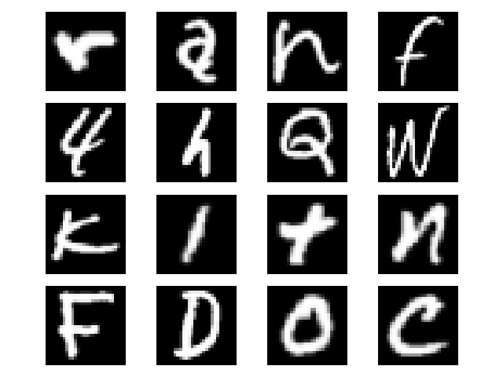

# Learning2write
This repo contains code for teaching a [neural network](https://en.wikipedia.org/wiki/Neural_network)
 based [reinforcement learning](https://en.wikipedia.org/wiki/Reinforcement_learning) agent how to write characters 
 (see Figure 1 below).

**Fig 1.** Example of an [ACKTR](https://openai.com/blog/baselines-acktr-a2c/) reinforcement learning agent trained on 5x5 patterns for about 44 million steps.
 

 
For training reinforcement learning agents I use 
[stable-baselines](https://github.com/hill-a/stable-baselines),
and for the environment I use my own custom [gym](https://gym.openai.com/) environment.
The environment provided has three sets of patterns (mostly letters and digits) 
that an agent can be trained on:
- A set of simple 3x3 patterns 
- A set of 5x5 patterns 
- Letters and digits from [EMNIST dataset](https://www.nist.gov/node/1298471/emnist-dataset) 
  (Extended MNIST dataset).
  This is essentially MNIST with both digits and letters (see Figure 2 below).

**Fig 2.** Sample of images from the EMNIST dataset. 


The goal is for the agent to fill in the squares in a grid to reproduce the pattern
that it has been presented as accurately as possible.

## Getting started
There is a convenience script `setup.sh` which assumes a UNIX-based system and automates most of the setup process. 
If you use this script then restart your terminal after successfully running it (to get conda set up correctly) and 
skip to step 3. 

1.  Install the required system packages:
    ```bash
    sudo apt-get update && sudo apt-get install cmake libopenmpi-dev python3-dev zlib1g-dev unzip xvfb python-opengl
    ```
    
    See the prerequisites section of [stable-baselines.readthedocs.io](https://stable-baselines.readthedocs.io/en/master/guide/install.html#prerequisites) 
    for instructions for other operating systems.

2.  Set up the python environment using conda:
    ```bash
    conda env create -f environment.yml
    ```
    or if you are not using conda, then make sure you have a python environment
    set up with all of the packages listed in the file `environment.yml`.
    
3.  Activate the conda environment:
    ```bash
    conda activate learning2write
    ```

4.  If you want to train an agent on images from the EMNIST dataset then you will
    need it handy. You can acquire the dataset by running the following:
    ```bash
    mkdir emnist_data
    cd emnist_data
    wget http://biometrics.nist.gov/cs_links/EMNIST/gzip.zip
    unzip gzip.zip
    mv gzip/* .
    rmdir gzip
    cd ..
    ```
    The download is about 550MB.
   
5.  Train a model:
    ```bash
    python train.py -steps 1000000
    ```
    Training the agent for more steps usually provides better results :)
    An ACKTR agent requires roughly 5 ~ 10 million steps for 3x3 patterns,
    and 10 ~ 20 million steps for 5x5 patterns. Not sure for the EMNIST dataset, 
    but probably a lot more :|
    
6.  Test a previously trained model:
    ```bash
    python test.py models/acktr_mlp_5x5.pkl -model-type acktr
    ```
    This opens a window that displays the environment and the reference/target 
    pattern on the left, and the agent's drawing and 
    its location (the big red dot).
    
7.  You can see the help text for these scripts by adding the flag `-h` or `--help`.


